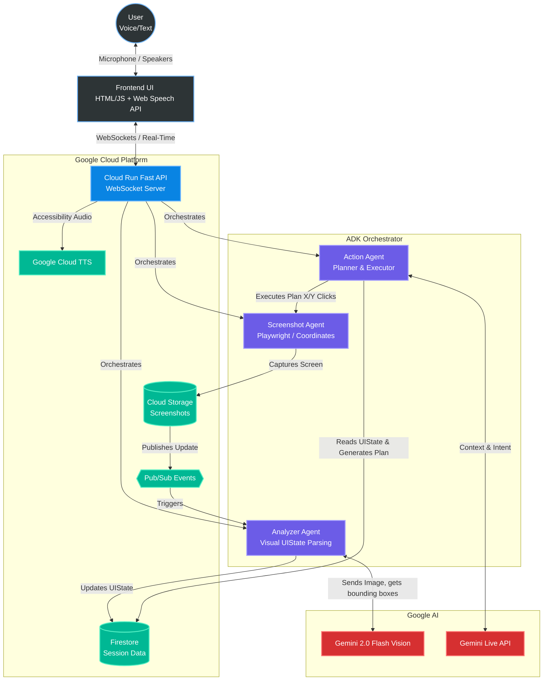

# Phantom UI Navigator - Devpost Submission Guide

Here are the specific pieces you requested for your Devpost submission! You can copy and paste these directly into the Devpost form and your GitHub README.

---

## 1. Google Cloud Deployment Proof (Terminal Commands)

To get your screen recording/screenshot proving the backend is running on Google Cloud, open the **Google Cloud Shell** (or your local terminal if `gcloud` is authenticated) and run these commands while recording your screen. These clearly demonstrate that your infrastructure is deployed and active:

```bash
# 1. Show your active GCP Project
gcloud config get-value project

# 2. List your active Cloud Run services to prove Phantom is deployed
gcloud run services list

# 3. Show the real-time logs of the Phantom service to prove it's handling requests
gcloud logging read "resource.type=cloud_run_revision AND resource.labels.service_name=phantom-ui-navigator" --limit 10
```
*Tip for the video:* Run `gcloud run services list`, point out the URL it outputs (which should match your demo URL), and then run the logs command to show recent traffic. This is irrefutable proof of GCP usage.

---

## 2. Text Description (For Devpost "About the Project" Section)

### **Summary & Features**
**Phantom** is a universal, multi-modal UI navigator that makes any software accessible—even legacy systems locked behind closed ecosystems. Unlike traditional automation tools or screen readers that rely on underlying code (DOM access, APIs, or tagged elements), Phantom navigates interfaces using pure vision and intelligence, exactly like a human does. 

**Key Features:**
*   **Zero-DOM Vision Parsing:** Evaluates and maps actionable UI coordinates using Gemini 2.0 Flash Vision, requiring zero source code or API access.
*   **Real-Time Voice Interaction:** Users speak natural commands, and Phantom executes them while narrating its actions back through an interleaved voice stream (powered by Gemini Live API & Google Cloud TTS).
*   **Multi-Step Orchestration:** Translates single-sentence intents into complex, step-by-step execution plans using the Google Agent Development Kit (ADK).
*   **Adaptive Accessibility:** Automatically translates complex visual interfaces into an accessible auditory experience for visually/motor-impaired users.

### **Technologies Used**
*   **AI Models:** Gemini 2.0 Flash (Vision capabilities for parsing UI), Gemini Live API (for conversational fluidity and barge-in support).
*   **Agent Orchestration:** Google Agent Development Kit (ADK) to construct the Planner, Vision, and Executor agents.
*   **Backend & Execution:** FastAPI (managing WebSockets for real-time streaming), Playwright (for executing visual coordinate clicks/typing without DOM hooks), Python 3.13.
*   **Google Cloud Infrastructure:** 
    *   **Cloud Run:** Serverless backend hosting.
    *   **Cloud Storage (GCS):** Storing continuous visual state screenshots.
    *   **Firestore:** Storing session states and user accessibility profiles.
    *   **Pub/Sub:** Handling highly decoupled event queues between the Screenshot, Analyzer, and Action agents.
    *   **Google Cloud TTS:** For accessible narrative feedback.

### **Data Sources**
Phantom does not rely on pre-trained datasets or external databases for its logic. Its primary "data source" is the **real-time visual screenshot stream** of the target application, which is dynamically evaluated in the moment by Gemini Vision to determine the current `UIState` (interactive elements, buttons, text fields).

### **Findings and Learnings**
1.  **The Constraint is the Feature:** Building an agent without DOM access seemed like a limitation at first, but we quickly realized it was our greatest advantage. By forcing the agent to rely strictly on visual coordinates (X, Y geometry) via Gemini Vision, we accidentally built a system that is immune to codebase updates, legacy tech debt, and obfuscated DOMs. If a human can see it, Phantom can click it.
2.  **Latency Matters in Multi-Modal:** Creating an interleaved, multi-modal experience required heavy optimization. Shifting from standard REST endpoints to bidirectional WebSockets drastically reduced the time between a user speaking, the agent capturing the screen, analyzing it, and responding. 
3.  **ADK's Modularity:** Using the Google ADK allowed us to cleanly separate the "Analyzer" (perceiving the screen) from the "Planner" (deciding what to do). This separation of concerns made the agent significantly less prone to hallucinations and looping errors compared to a monolithic prompt structure.

---

## 3. Architecture Diagram (Mermaid)

*You can paste this code block directly into a GitHub README or any markdown viewer that supports Mermaid (like Notion). It visually fulfills the Devpost requirement for an Architecture Diagram.*


