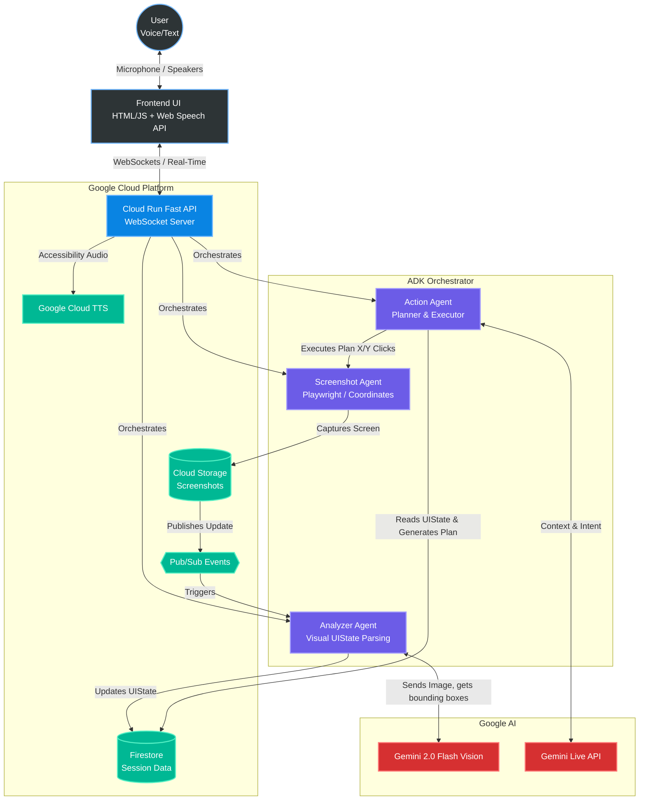

# 🛸 PHANTOM UI Navigator

**🌟 Live Demo: [https://phantom-ui-navigator-mqwge2lklq-uc.a.run.app](https://phantom-ui-navigator-mqwge2lklq-uc.a.run.app)**

Phantom navigates any legacy UI by pure vision and voice. No DOM access. No source code. No API.
Just eyes, voice, and surgical precision.

## 🎯 What is Phantom?

Phantom is a multimodal AI agent that:
- **Sees** any application screen via Gemini Vision
- **Understands** UI elements, layouts, and workflows
- **Acts** on user voice commands via Playwright (coordinates only)
- **Talks** back in real-time, narrating every action

**Target:** Legacy enterprise apps (SAP, Oracle, SCADA, HR portals) that have zero API, zero documentation, zero automation path.

## 🏗️ Architecture

```
User (Voice/Text) → WebSocket → FastAPI (Cloud Run)
                                    ├── Screenshot Agent (Playwright → GCS)
                                    ├── Analyzer Agent  (Gemini Vision → UIState)
                                    └── Action Agent    (Plan → Execute → Validate)
```

**Key principle:** Zero DOM access — all interactions happen via visual coordinates.

## 🚀 Quick Start

### Prerequisites
- Python 3.13+
- Docker (optional)
- GCP Service Account key (`phantom-sa-key.json`)

### Local Setup
```bash
# 1. Clone & install
cd phantom-ui-navigator
pip install -r requirements.txt
playwright install chromium

# 2. Configure environment
cp .env.example .env
# Edit .env with your GEMINI_API_KEY

# 3. Run 
python -m uvicorn api.main:app --host 0.0.0.0 --port 8000 --reload
```

### Docker Setup
```bash
# Build & run
docker-compose up --build

# Open browser
open http://localhost:8000
```

## 📁 Project Structure

```
phantom-ui-navigator/
├── agents/
│   ├── screenshot_agent.py   # Screen capture → GCS → Pub/Sub
│   ├── analyzer_agent.py     # Gemini Vision → structured UIState
│   └── action_agent.py       # Plan → execute → validate loop
├── api/
│   └── main.py               # FastAPI + WebSocket server
├── frontend/
│   ├── index.html            # Dark cyberpunk UI
│   └── app.js                # WS client, overlay, voice
├── config/
│   └── settings.py           # Pydantic settings (env-driven)
├── Dockerfile
├── docker-compose.yml
├── requirements.txt
└── .env.example
```

## 🛠️ Tech Stack

| Layer | Technology |
|-------|-----------|
| AI Vision | Gemini 2.0 Flash (google-genai) |
| Agent Framework | Google ADK |
| Browser Automation | Playwright (coordinates only) |
| Backend | FastAPI + WebSocket |
| Cloud | GCP (Cloud Run, Firestore, GCS, Pub/Sub, Secret Manager) |
| Frontend | Vanilla HTML/JS + Web Speech API |

## 📡 API Endpoints

| Method | Path | Description |
|--------|------|-------------|
| `GET` | `/api/health` | Health check |
| `POST` | `/api/session/start` | Start browser session |
| `POST` | `/api/session/stop` | Stop session |
| `POST` | `/api/command` | Execute voice/text command |
| `POST` | `/api/action` | Single action (click, type, etc.) |
| `GET` | `/api/state` | Current UI state |
| `GET` | `/api/screenshot` | Current screenshot (base64) |
| `POST` | `/api/navigate` | Navigate to URL |
| `WS` | `/ws` | Real-time bidirectional |

## 🏆 Hackathon

**Gemini Live Agent Challenge** — Devpost
- Category: **UI Navigator** ($10K)
- Additional targets: Best Technical Architecture ($5K), Best Innovation ($5K)

## 📜 License

MIT

## 📊 Architecture

