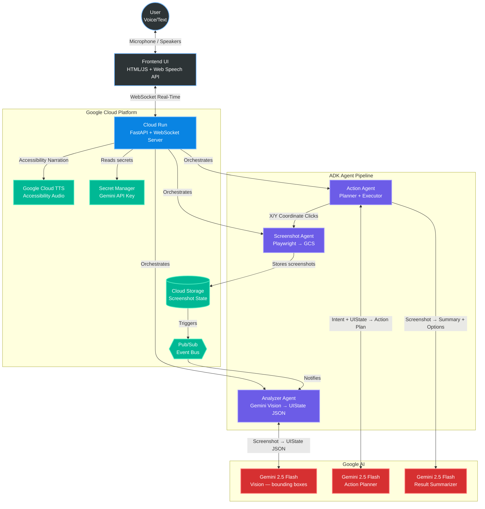

# 🛸 PHANTOM UI Navigator

> **Gemini Live Agent Challenge — Category: UI Navigator**

**🌟 Live Demo: [https://phantom-ui-mqwge2lklq-uc.a.run.app](https://phantom-ui-mqwge2lklq-uc.a.run.app)**

Phantom navigates any UI by **pure vision and voice**. No DOM access. No source code. No API needed. Just eyes, voice, and surgical precision — powered by Gemini Vision running on Google Cloud.

---

## 🎯 What is Phantom?

Phantom is a multimodal AI agent that:
- **Sees** any application screen via **Gemini 2.5 Flash Vision** — no DOM, no selectors
- **Understands** UI elements, layouts, and workflows from a screenshot alone
- **Acts** on natural language commands via Playwright (coordinate-only clicks & typing)
- **Talks back** in real-time, narrating every action via **Google Cloud TTS**
- **Hands control back** to the user (co-pilot mode) for CAPTCHAs or sensitive steps

**Target use cases:** Legacy enterprise apps (SAP, Oracle, SCADA, HR portals) with zero API, zero documentation, and zero automation path — if a human can see it, Phantom can use it.

---

## 🏗️ Architecture



**Key principle:** Zero DOM access — all interactions are visual coordinates, like a human at a screen.

---

## 🚀 Spin-Up Instructions

### Option A — Local (Python)

**Prerequisites:** Python 3.13+, a Gemini API key or GCP service account with Vertex AI access.

```bash
# 1. Clone the repository
git clone https://github.com/0Papitchu/PHANTOM-DEVPOST-HACKATHON
cd PHANTOM-DEVPOST-HACKATHON

# 2. Install Python dependencies
pip install -r requirements.txt

# 3. Install Playwright's Chromium browser
playwright install chromium

# 4. Configure environment variables
cp .env.example .env
```

Edit `.env` with your values:

```env
# Required: Gemini API Key (get one at https://aistudio.google.com)
GEMINI_API_KEY=your_key_here
GEMINI_MODEL=gemini-2.5-flash

# Optional: GCP project for Vertex AI (uses $300 free credits instead of API key quotas)
GCP_PROJECT_ID=your-gcp-project
GCP_REGION=us-central1
GOOGLE_APPLICATION_CREDENTIALS=./phantom-sa-key.json

# Optional GCP services (app runs without them — GCS/Pub/Sub gracefully degrade)
STORAGE_BUCKET=your-bucket-name
```

```bash
# 5. Start the server
python -m uvicorn api.main:app --host 0.0.0.0 --port 8000 --reload

# 6. Open in browser
open http://localhost:8000
```

---

### Option B — Docker (recommended for reproducibility)

```bash
# 1. Clone
git clone https://github.com/0Papitchu/PHANTOM-DEVPOST-HACKATHON
cd PHANTOM-DEVPOST-HACKATHON

# 2. Configure env
cp .env.example .env
# Edit .env — set GEMINI_API_KEY at minimum

# 3. Build and run
docker-compose up --build

# 4. Open browser
open http://localhost:8000
```

---

### Option C — Deploy to Google Cloud Run

```bash
# Prerequisites: gcloud CLI installed & authenticated
gcloud auth login
gcloud config set project YOUR_PROJECT_ID

# Build and push image to Container Registry
gcloud builds submit --tag gcr.io/YOUR_PROJECT_ID/phantom-ui .

# Deploy to Cloud Run
gcloud run deploy phantom-ui \
  --image gcr.io/YOUR_PROJECT_ID/phantom-ui:latest \
  --region us-central1 \
  --platform managed \
  --allow-unauthenticated \
  --memory 2Gi \
  --cpu 2 \
  --timeout 300 \
  --set-env-vars "GCP_PROJECT_ID=YOUR_PROJECT_ID,GEMINI_MODEL=gemini-2.5-flash"
```

The deploy takes ~4 minutes. The service URL is printed at the end.

---

## ☁️ Google Cloud Deployment Proof

**Live service:** `https://phantom-ui-mqwge2lklq-uc.a.run.app`
**GCP Project:** `phantom-ui-navigator` | **Region:** `us-central1`

To verify the backend is running on GCP and actively calling Vertex AI, run:

```bash
# Show active Cloud Run service
gcloud run services describe phantom-ui --region us-central1

# Show real-time logs (includes Vertex AI API calls)
gcloud logging read \
  "resource.type=cloud_run_revision AND resource.labels.service_name=phantom-ui" \
  --limit 10 --project phantom-ui-navigator
```

**Code proof — Vertex AI call in production logs:**
```
POST https://us-central1-aiplatform.googleapis.com/v1beta1/projects/phantom-ui-navigator/
     locations/us-central1/publishers/google/models/gemini-2.5-flash:generateContent
     "HTTP/1.1 200 OK"
```

See [`agents/gemini_utils.py`](agents/gemini_utils.py) — Vertex AI client initialization and retry logic.
See [`agents/analyzer_agent.py`](agents/analyzer_agent.py) — live Gemini Vision calls with `image/png` screenshot payloads.
See [`agents/screenshot_agent.py`](agents/screenshot_agent.py) — Google Cloud Storage uploads and Pub/Sub events.
See [`api/main.py`](api/main.py) — Google Cloud TTS integration and Secret Manager key resolution.

---

## 📁 Project Structure

```
phantom-ui-navigator/
├── agents/
│   ├── screenshot_agent.py   # Playwright screen capture → GCS → Pub/Sub
│   ├── analyzer_agent.py     # Gemini Vision → structured UIState JSON
│   ├── action_agent.py       # Planner (Gemini) + Executor (coordinates)
│   ├── adk_agents.py         # Google ADK LlmAgent wrappers
│   ├── mcp_client.py         # Chrome DevTools MCP bridge (optional)
│   └── gemini_utils.py       # Singleton Gemini client + exponential backoff
├── api/
│   └── main.py               # FastAPI + WebSocket + auto-navigation + TTS
├── frontend/
│   ├── index.html            # Cyberpunk UI with bounding-box overlay
│   └── app.js                # WebSocket client, voice I/O, manual control
├── config/
│   └── settings.py           # Pydantic settings (all config via env vars)
├── Dockerfile                # Production container (Python 3.13 + Playwright)
├── docker-compose.yml        # Local dev stack
├── requirements.txt
└── .env.example              # All configurable variables with defaults
```

---

## 🛠️ Tech Stack

| Layer | Technology |
|-------|-----------|
| AI Vision | Gemini 2.5 Flash — multimodal screenshot → UIState |
| AI Planning | Gemini 2.5 Flash — intent → action plan |
| Agent Framework | Google ADK (`google-adk`) |
| Browser Automation | Playwright (coordinate-only, zero DOM) |
| Backend | FastAPI + WebSocket (Python 3.13) |
| Voice Input | Web Speech API (browser-native) |
| Voice Output | Google Cloud TTS (Neural2 voice) |
| Cloud Hosting | GCP Cloud Run (serverless, auto-scaling) |
| Screenshot Storage | GCP Cloud Storage |
| Event Bus | GCP Pub/Sub |
| Secret Management | GCP Secret Manager |

---

## 🎮 How to Use

### Basic flow (no session required)
1. Type or speak a command — e.g. **"Find flights from Paris to Dubai on March 20"**
2. Phantom automatically selects the right website, opens it, and performs the actions
3. The agent narrates what it sees and offers interactive option cards for next steps
4. Click any option card or give a new voice command to continue

### Take Control (co-pilot mode for CAPTCHAs)
When a CAPTCHA or human-only step blocks the agent, PHANTOM **auto-detects** it and activates co-pilot mode:
1. The **TAKE CONTROL** button turns green automatically
2. Click directly on the screenshot to interact (e.g. solve the CAPTCHA)
3. Click **USER CONTROL** again to hand back to Phantom

### Manual session start
1. Enter a URL in the address bar → click **START** (or press Enter)
2. Phantom launches a headless Chromium, analyzes the page, and shows detected elements
3. Type or speak commands in the input field

---

## 📡 API Reference

| Method | Path | Description |
|--------|------|-------------|
| `GET` | `/api/health` | Health check — returns session state |
| `POST` | `/api/session/start` | Launch browser + initial analysis |
| `POST` | `/api/session/stop` | Stop session cleanly |
| `POST` | `/api/command` | Execute a natural language command |
| `POST` | `/api/action` | Execute a single atomic action |
| `GET` | `/api/state` | Current UI state (fresh Gemini analysis) |
| `GET` | `/api/screenshot` | Current screenshot as base64 |
| `POST` | `/api/navigate` | Navigate to a new URL |
| `WS` | `/ws` | Bidirectional real-time channel |

---

## 🏆 Hackathon

**Gemini Live Agent Challenge** — Devpost (Feb 16 – Mar 16, 2026)

**Category: UI Navigator** — *Visual UI Understanding & Interaction*
Mandatory tech: Gemini multimodal for screenshot interpretation + hosted on Google Cloud ✅

---

## 📜 License

MIT
